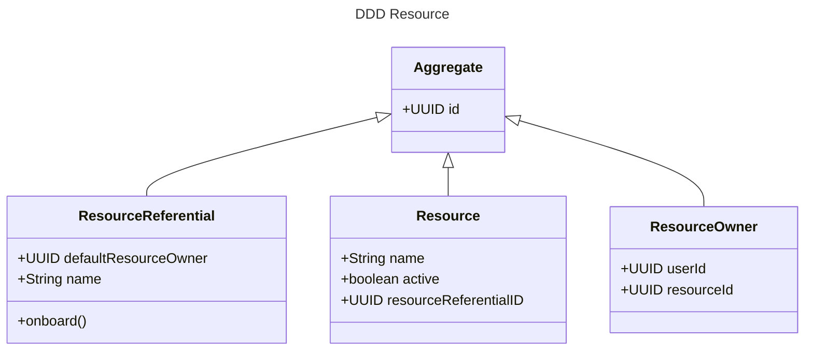

<h1 align="center">Welcome to ddd-showcase 👋</h1>

The goal of this project is to demonstrate why ddd models are importants

# Demo use case

A ResourceReferential can onboard new resources.

Each new resource should define a ResourceOwner.

## DDD Steps

Begin by thinking about the model.

Why the model ? Because this allows us to support our use cases conceptually.

DO NOT start with the database. 
DO NOT start with the clients.

### Aggregates

Aggregate contains *only* pure logic. 
They have a state and operations can modify this state. 
Any operation that will query the system or update it's state will go through an aggregate. It's a controlled way to go into the system. 
This means no update can be done directly in the repository.

*Code demo*

Recap : we created the `ResourceReferential` and the `Resource` class.
There is no persistence yet. The `ResourceOwner` is not created. 
We initialized the `Resource` with a default state in a controlled manner.

### Our domain is correct, but it is not really useful

Nothing interesting can be done with our domain yet. We need to think about the persistence. 
In DDD, persistence is:
* An interface in the domain model.
* Its implementation is the infrastructure.

With Spring, we can go two routes:

a) Use the Spring JPA Repository directly in the domain layer 
b) Write an abstraction and a mapping method

*Code demo of a)*

The advantages of a) is that it is easy to integrate. But what if your data already exist ? Then you have two options:

a) Use the existing table, if it fits the model. This means that you will only update some parts of the table with this model. This can be a problem with concurrency.

b) Create a new table, and migrate data from the existing table to the new table. Then, if the old table is already used by existing code, a synchronization technique should be used (for instance events). Synchronization can also be done from the new table to the old table.

### DDD Entrypoint

We need a way to communicate in the domain in a controlled way. This is the application layer.

*Code demo of b)*

### Let's expose our domain to the outside

*Code demo*

### What about the resource owner ?

It could be argued that the resource owner is a separate concern of the resource. In this case, it would be good to isolate it as much as possible. Let's start by defining the ResourceOwner aggregate.

*Code demo*

Please note that we could separate in the domain layer using DDD modules. 
Then, we can work on the Application Services.

*Code demo*

## Show your support

Give a ⭐️ if this project helped you!

***
_This README was generated with ❤️ by [readme-md-generator](https://github.com/kefranabg/readme-md-generator)_