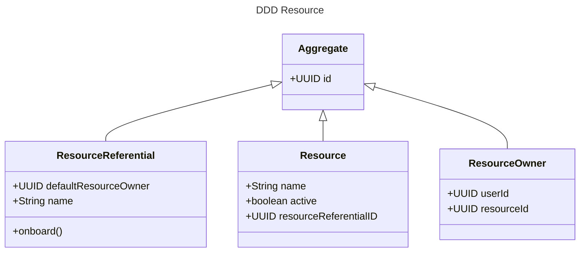

<h1 align="center">Welcome to ddd-showcase 👋</h1>

The goal of this project is to demonstrate why ddd models are importants

# Demo use case

A ResourceReferential can onboard new resources.

Each new resource should define a ResourceOwner.

## DDD Steps

Begin by thinking about the model.

Why the model ? Because this allows us to support our use cases conceptually.

DO NOT start with the database. 
DO NOT start with the clients.

### Aggregates

Aggregate contains *only* pure logic. 
They have a state and operations can modify this state. 
Any operation that will query the system or update it's state will go through an aggregate. It's a controlled way to go into the system. 
This means no update can be done directly in the repository.

*Code demo*

Recap : we created the `ResourceReferential` and the `Resource` class.
There is no persistence yet. The `ResourceOwner` is not created. 
We initialized the `Resource` with a default state in a controlled manner.

## Show your support

Give a ⭐️ if this project helped you!

***
_This README was generated with ❤️ by [readme-md-generator](https://github.com/kefranabg/readme-md-generator)_