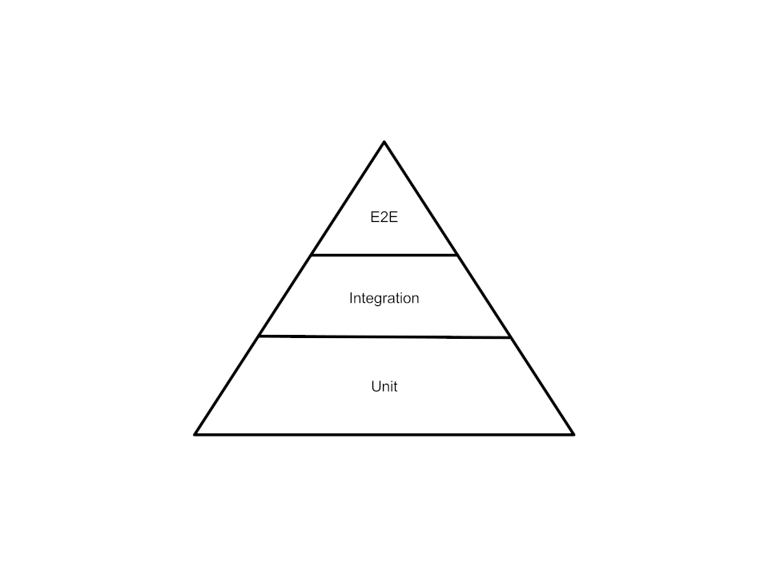

<!--suppress HtmlDeprecatedAttribute -->
<h1 align="center">DDD and hexagonal architecture tests</h1>

# Effective ways to ensure appropriate application behavior

They are two ways to ensure appropriate application behavior in production :

1. During the build phase: a complete automated test suite makes sure that our application is coded the right way
2. During the run phase: observability and metrics allow us to understand if our application in production is behaving properly

# Observability

* **Logs** allow us to debug our application behaviour
* **Technical metrics** allow us to control our technical application behaviour (i.e. number of connection to the database)
* **APM** allow us to understand the usage of our application: number of 500 / 404 / 201, response time (average, median, 95 percentile, 99 percentile, 99.9 percentile...)
* **Business metrics** allow us to understand how the application is used

Two of the quickest way to get business metrics are :
* Analytics tools such as google analytics 
* Listening for any business events sent by our application

# Testing

## Test strategy

To properly test an application, we need to have a strategy. 
This strategy makes sure we tested the application at all appropriate levels.

Several strategies exist: testing from outside in (such as contract first testing), or testing each layer.

## Test pyramid

The testing pyramid tells us we need to focus on useful and maintainable tests.
Each test has it's utility:
* Unit tests allow us to validate the business behaviour of our application
* Integration tests allow us to validate the interaction of our application to the outside
* E2E tests allows us to validate that our classes are properly configured and work well together in production scenario

Each business rule needs to be tested in unit test. 
Most interactions with the outside needs to be tested in integration tests. 
A few E2E tests validate the global behavior of the application.

# TDD

Test Driven Development is an approach that allows us to tests all of our application.
A TDD application contains a complete suite of non regression tests and is very robust.

## The TDD cycle

In TDD, we always start by writing a failing test. 
Then, we run the test. Of course, it fails. 
Then, we write the quickest implementation we can. 
We test it until this works. 
Then, one the test stops failing, we refactor the code.

We call this the RED - GREEN - REFACTOR loop.

## TDD with hexagonal architecture

TDD is possible with hexagonal architecture. Usually, we start by writing and testing the domain. 
Domain tests are unit tests.

Then, we write and we test the repository - beware to not test the framework. 
These are integration tests.

Then, we write and we test the Applicative Service. This allows us to understand the domain is properly wired. 
These are unit tests, with mocks.

Then, we test all infrastructure code. External API calls, for example. 
These are integration tests.

Then, we test our controllers. 
These are integration tests.

## Demo !

### Design phase

A resource referential has a name and a default resource owner. 
Resource referential are pre-existing in the system.
A user can onboard a resource referential: this creates a new resource. 
The name of the onboarded resource matches the name in the resource referential. 
An onboarded resource is inactive by default.
A resource owner corresponding to the default resource owner is created for this resource.

### Code phase

Demo

## Show your support

Give a ⭐️ if this project helped you!

***
_This README was generated with ❤️ by [readme-md-generator](https://github.com/kefranabg/readme-md-generator)_